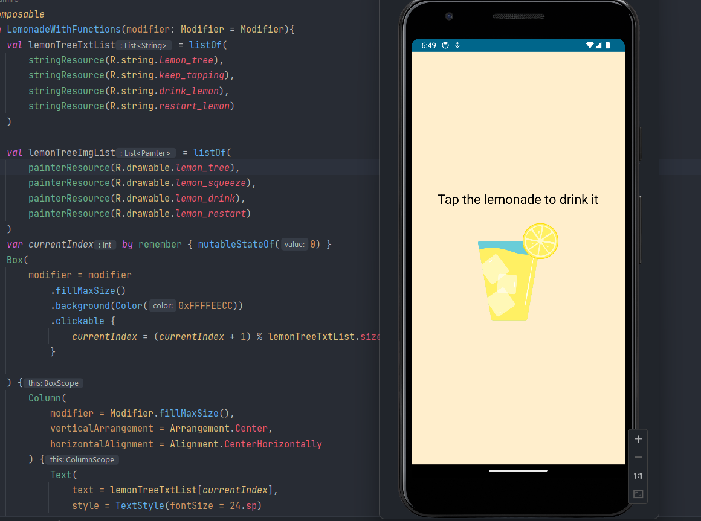

# Lemonade App

Este es un pequeño proyecto de práctica desarrollado con Jetpack Compose, Kotlin y Android Studio. La aplicación muestra una imagen y un texto relacionados con la elaboración de limonada y cambia la imagen y el texto cada vez que el usuario toca la pantalla.

## Captura de pantalla

## Requisitos previos

- Android Studio (versión recomendada: 4.0 o superior)
- Kotlin (versión recomendada: 1.5 o superior)

## Instalación y Ejecución

1. Clona este repositorio en tu computadora.
2. Abre Android Studio y selecciona "Abrir un proyecto existente".
3. Navega hasta el directorio donde clonaste el repositorio y selecciona la carpeta "Lemonade".
4. Espera a que Android Studio sincronice el proyecto y descargue las dependencias necesarias.
5. Conecta tu dispositivo Android a la computadora o utiliza un emulador.
6. Ejecuta la aplicación haciendo clic en el botón de "Run" (Ejecutar) en Android Studio o presiona `Shift + F10`.
7. La aplicación se instalará en tu dispositivo o emulador y se ejecutará automáticamente.

## Cómo funciona

La aplicación muestra inicialmente una imagen y un texto relacionado con el árbol de limones. Cada vez que el usuario toca la pantalla, la imagen y el texto cambian a las siguientes opciones:

1. Imagen y texto relacionados con "¡Árbol de limones!"
2. Imagen y texto relacionados con "¡Sigue tocando!"
3. Imagen y texto relacionados con "¡Bebe limonada!"
4. Imagen y texto relacionados con "¡Reiniciar la limonada!"

Una vez que se llega a la última opción, la aplicación vuelve a la primera y continúa ciclando a través de las imágenes y los textos.

## Estructura del Proyecto

- `MainActivity.kt`: Esta es la actividad principal que inicia la aplicación y carga el composible principal `DrinkingLemonadeApp`.

- `LemonadeWithFunctions.kt`: Este archivo contiene el composable `LemonadeWithFunctions`, que es el componente principal de la aplicación. Es responsable de mostrar la imagen y el texto y cambiarlos en función de las interacciones del usuario.

- `strings.xml`: Este archivo contiene los recursos de cadena utilizados en la aplicación, incluidos los textos relacionados con el árbol de limones y la limonada.

- `R.drawable`: Esta carpeta contiene las imágenes utilizadas en la aplicación, como la imagen del árbol de limones, exprimiendo limón, bebiendo limonada y reiniciando la limonada.

## Conclusión

Este proyecto es una introducción sencilla a Jetpack Compose, el nuevo toolkit de IU de Android, que permite desarrollar interfaces de usuario de forma más declarativa y eficiente. Con Jetpack Compose, es fácil crear interfaces de usuario interactivas y atractivas en Android. ¡Espero que hayas disfrutado desarrollando esta pequeña aplicación de limonada como ejercicio de práctica!

Si tienes alguna pregunta o comentario, no dudes en hacérmelo saber. ¡happy coding! 🍋🥤
